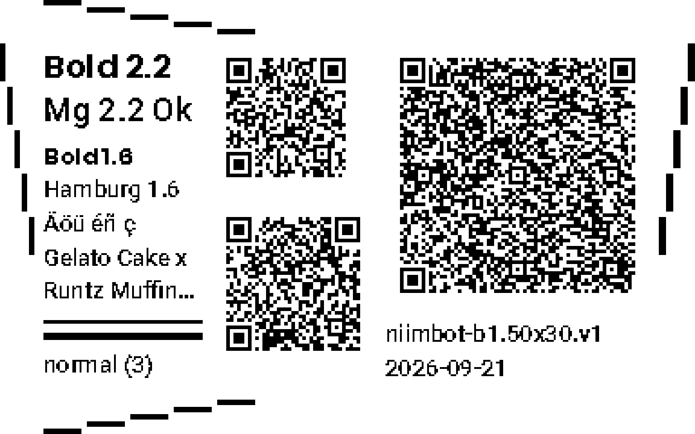

# Label printer evidence

Issue: [growspace_manager_workspace#231](https://github.com/Venosta-web/growspace_manager_workspace/issues/231)

A Capability Profile prints production labels only once it carries a
reviewed **Release Evidence Record**. The backend enforces this in
`growspace_manager/labels/canonical/evidence.py`. A record counts only if all
eight rows of the physical matrix were run and passed, each with numbers and
retained photographs. It must also have been taken against the compiler,
renderer, fonts, QR model and safety policy that ship. Without such a record,
the profile stays provisional and production printing stays disabled, with the
missing parts listed in `evidence_invalidated_by`.

Most of the matrix comes from one label: the **evidence label**.



Every probe on it is sized from the profile's own claimed limits, so it tests
exactly what the profile says it can do:

| Where                   | What                                                                                          | Claim it tests                                                     |
| ----------------------- | --------------------------------------------------------------------------------------------- | ------------------------------------------------------------------ |
| Four edges              | five staggered ticks per edge, 0.5 mm apart, stepping inward, as on the calibration label     | Printable Area edges, origin, feed alignment                        |
| Middle column, top      | QR: `homeassistant://navigate/growspace/plant/p1` (43 bytes)                                 | shortest real target at 2 dots/module, 4-module quiet zone, medium |
| Middle column, bottom   | QR: a dashboard plant URL (74 bytes)                                                          | typical target, same settings                                       |
| Right, large            | QR: exactly 256 bytes ending in `#256`                                                        | the claimed maximum encoded bytes, same settings                    |
| Left, first two lines   | `Bold 2.2`, `Mg 2.2 Ok`                                                                       | comfort threshold, both faces                                       |
| Left, next lines        | `Bold 1.6`, `Hamburg 1.6`, `Äöü éñ ç`, a long strain name wrapped to two lines and truncated | readable floor, both faces, accented Latin, wrapping                |
| Left, two rules         | 0.25 mm and 0.5 mm                                                                            | thinnest claimed divider                                            |
| Identity                | profile, `density (level)`, print date                                                        | which print this is; also printed at the floor                      |

## Printing it

The printer is attached to whichever Home Assistant you print from, which is
usually not the dev instance. That Home Assistant must run a
`growspace_manager` that includes the evidence label, and you need a
long-lived access token for it.

```bash
HA_ACCESS_TOKEN=<token> ./scripts/label-evidence-print --base-url http://homeassistant.local:8123 --copies 5
```

This prints the label five times at each density the profile maps (`low`,
`normal`, `high` on the B1 profile). If exactly one Niimbot printer is
registered, the script uses it; otherwise it lists the printers and asks for
`--device`. Every print's raster identity and time, along with the printer's
model and firmware as Home Assistant reports them, is written to
`artifacts/label-evidence/<profile>/<timestamp>.json`. That file also holds a
Release Evidence Record skeleton with every required field. Fields nobody has
filled in yet are empty strings, which the product reports as missing, never
as passed.

## What to read off it

Photograph or scan every label flat and in focus, with a millimetre ruler in
frame. Then fill in the record's `results`:

| Row             | From                                           | Measure                                                                                                                                                                                                                               |
| --------------- | ---------------------------------------------- | ------------------------------------------------------------------------------------------------------------------------------------------------------------------------------------------------------------------------------------- |
| `edges`         | the edge ticks on each `normal` copy           | for each edge, the first tick that printed (0 = outermost; each step is 0.5 mm). The top and bottom offsets are the feed alignment, because the B1 feeds along y.                                                                          |
| `rotation`      | any copy                                       | the text reads upright and the QR codes are square. The profile admits only 0°, so there is nothing else to cover.                                                                                                                     |
| `text`          | the left column at each density                | whether each line is readable at arm's length, whether the accented line shows all six characters, and whether the long line wraps to two lines and ends in `…`                                                                          |
| `qr`            | all three QR codes at each density             | scan each with every phone you claim. The long code decodes to 256 characters ending `#256`. Record phone model and OS.                                                                                                             |
| `logo`          | a real strain label with a breeder logo        | not on this sheet, because the integration ships no logo asset. Print a strain label whose breeder has a high-contrast logo, and one with a grayscale logo.                                                                                  |
| `density`       | one copy per density                           | each is legible without bleeding, and the rules are separate lines at every level. Set `covers` to the densities you accept.                                                                                                          |
| `repeatability` | the five copies at `normal`                    | the edge tick reading of every copy. Drift is the spread. Note whether the first label of the run differs and whether any has a missing band.                                                                                         |
| `batch`         | a production batch from the card               | a batch of at least three records with two copies each. Were any labels skipped, doubled or misaligned? Did a retry reprint only the failed items?                                                                                           |

Put the photograph paths in each row's `artifacts`, set `operator`,
`reviewed_by` and `reference` (where the record and photographs are kept), and
write anything that did not go to plan in `deviations`.

## Promotion

A reviewed record is attached to the profile in `growspace_manager`. The
record's `profile_definition` is the profile's `definition_digest`, which is
computed in code, so it is filled in there. The profile's claimed limits are
then narrowed to what was actually proven. Examples: only the error
correction levels you scanned, only the densities you accepted, and only 0°
rotation. A profile advertises only tested combinations. Promotion bumps the
capability generation, because the advertised profile changed.

Changing the compiler, renderer, fonts, QR model or safety policy, or the
profile's own geometry, limits or density mapping, returns the profile to
provisional by name. The record is kept, and the profile is proven again
with a fresh run of this procedure.
